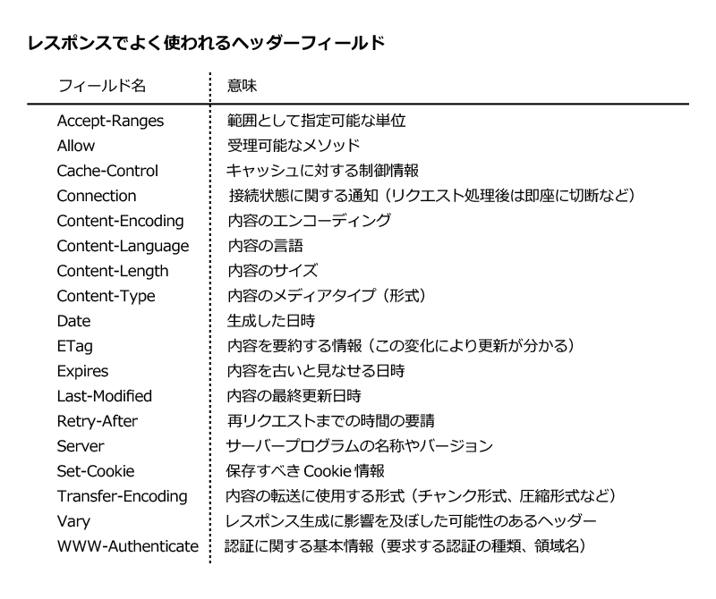

# todo_api_shelf
Shelf を使ってDartでバックエンドを書いてみる

# Shelf とは
DartのWebフレームワーク

## httpステータスコード
200 : 正常に処理ができた
[一覧参考](https://qiita.com/unsoluble_sugar/items/b080a16701946fcfce70)

## Response
### header
サーバーがクライアントにレスポンスを返すときに、レスポンスの内容を補足するために付加される

[出典](https://atmarkit.itmedia.co.jp/ait/articles/1511/27/news013_2.html)

### body
HTTPリクエストメッセージの本文の部分のことで、クライアントがサーバーに送信したいデータを含めることができる
